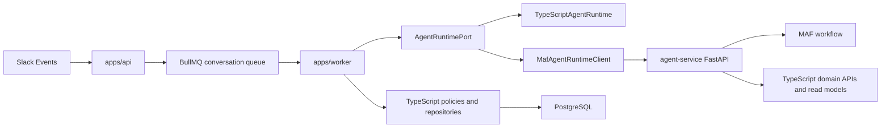
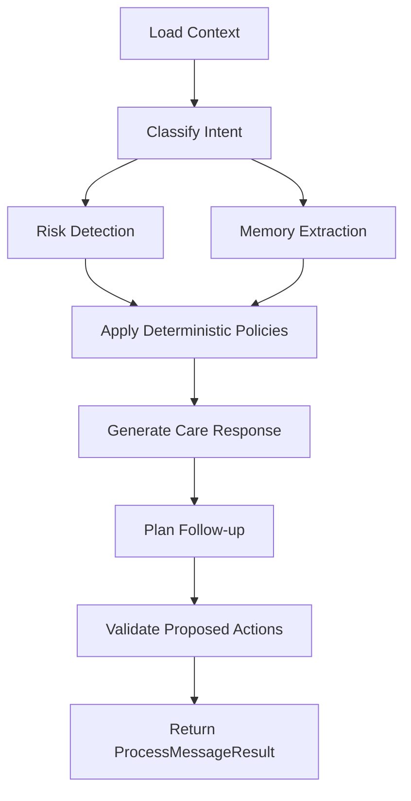

# Architecture Spine - MAF Runtime Migration

## Design Paradigm

Brownfield hexagonal strangler. The existing TypeScript application remains the host shell and policy owner. The MAF service is introduced as a replaceable runtime behind `AgentRuntimePort`, not as a rewrite of transport, queues, persistence, or tenant policy.



## Invariants & Rules

### AD-1 - Runtime Boundary Is The Only Switch Point

- **Binds:** CAP-1, CAP-2
- **Prevents:** Worker processors, domain use cases, or Slack handlers depending directly on MAF, FastAPI, or Python types.
- **Rule:** All inbound conversation processing must enter through `AgentRuntimePort.processMessage`. `ConversationProcessor` may depend on the port token, never on a concrete runtime implementation.

### AD-2 - TypeScript Owns First-Slice Side Effects

- **Binds:** CAP-1, CAP-2, CAP-3
- **Prevents:** Python and TypeScript independently writing memory, goals, risk signals, scheduled actions, messages, or survey evidence.
- **Rule:** Until an aggregate has an explicit ownership-transfer AD, the MAF service may return only proposals or commands. Existing TypeScript policies and repositories validate and execute every side effect.

### AD-3 - MAF Stays Inside `agent-service`

- **Binds:** CAP-2
- **Prevents:** MAF APIs leaking into shared TypeScript packages and making future framework replacement a cross-repo rewrite.
- **Rule:** `agent-framework` imports are allowed only inside `agent-service`. Shared runtime contracts use JSON-compatible request/result schemas from the canonical source required by AD-14.

### AD-4 - First Transport Is JSON HTTP

- **Binds:** CAP-1, CAP-2, CAP-3
- **Prevents:** Streaming concerns blocking shadow-mode instrumentation and the first runtime client.
- **Rule:** The first `MafAgentRuntimeClient` uses request/response JSON over HTTP. SSE or token streaming is deferred until the non-streaming shadow path passes baseline gates.

### AD-5 - Fallback Stops At The First Side Effect

- **Binds:** CAP-1, CAP-3
- **Prevents:** Duplicate replies, duplicate follow-ups, or double-applied memory when MAF partially succeeds and TypeScript retries the turn.
- **Rule:** Runtime fallback to `TypeScriptAgentRuntime` is allowed only before any proposed action has been executed. Requests, runtime attempts, tool calls, and proposed actions must carry idempotency keys before MAF can become user-facing.

### AD-6 - Shadow Mode Is A First-Class Runtime Mode

- **Binds:** CAP-3, CAP-4
- **Prevents:** Canary rollout based on isolated local tests or subjective output inspection.
- **Rule:** Shadow execution records both current and candidate results with trace IDs, runtime versions, validation status, latency, model-call count, tool-call count, cost, risk, memory candidates, and proposed actions.

### AD-7 - Durable State Is Split By Responsibility

- **Binds:** CAP-2, CAP-3
- **Prevents:** Long conversations being persisted as a single growing runtime blob or lost on service restart.
- **Rule:** Production or non-local shadow execution requires durable session/checkpoint storage before it runs. Session state, workflow checkpoints, and conversation history are separate storage concerns. Process-local MAF session/history storage is allowed only for local development.

### AD-8 - Session Keys Include Slack Conversation Scope

- **Binds:** CAP-2, CAP-3
- **Prevents:** Parallel Slack threads mixing context for the same user.
- **Rule:** MAF session keys use workspace, user, external conversation, and thread-or-DM scope. `userId` alone is invalid as a session key.

### AD-9 - Evaluation Gates Block Rollout

- **Binds:** CAP-4
- **Prevents:** Replacing a safety-sensitive runtime without measurable parity.
- **Rule:** MAF cannot enter canary unless `conversation-sim` and migration baseline gates pass with no worse critical risk false-negative rate, no duplicate scheduled actions, and acceptable memory false-positive rate.

### AD-10 - Deterministic Policy Outranks Agent Output

- **Binds:** CAP-2, CAP-4
- **Prevents:** Agent-generated prose or actions bypassing safety, privacy, proactive-message, reminder, or survey rules.
- **Rule:** Risk thresholds, quiet hours, consent, follow-up cooldowns, survey blocking, duplicate prevention, and action validation remain deterministic application policies.

### AD-11 - MAF Hosting Helpers Are Optional

- **Binds:** CAP-2
- **Prevents:** The first service depending on preview hosting packages before their operational value is proven.
- **Rule:** The first Python service uses FastAPI-owned routes over stable core `agent-framework`. `agent-framework-hosting` helpers remain deferred because Microsoft documents them as prerelease Python packages; they may be adopted later only behind the same HTTP contract.

### AD-12 - New Python Runtime Uses A Maintained Python Line

- **Binds:** CAP-2
- **Prevents:** Starting a new service on a Python line that is already security-only.
- **Rule:** The first Python service targets Python 3.13.x as a conservative maintained line. Python 3.12 is not the default target for new service work because it is already in security-fix-only mode; Python 3.14 may replace 3.13 only after dependency compatibility is verified during service bootstrap.

### AD-13 - Runtime Router Owns Mode Selection

- **Binds:** CAP-1, CAP-3
- **Prevents:** Process-start DI binding, feature flags, and shadow recording each choosing different runtime behavior.
- **Rule:** The `AGENT_RUNTIME_PORT` provider resolves to a runtime router, not directly to a concrete runtime once MAF work starts. The router evaluates per job before invoking a runtime. Precedence is global kill switch, tenant/user denylist, shadow mode, canary mode, then TypeScript default. Flag evaluation failure is fail-closed to TypeScript-only.

### AD-14 - Runtime Contract Has One Schema Source

- **Binds:** CAP-1, CAP-2, CAP-3
- **Prevents:** TypeScript and Python implementing incompatible request/result shapes while both remain JSON-compatible.
- **Rule:** Before any `MafAgentRuntimeClient` or Python runtime endpoint code is added, the team must choose one canonical schema source for the HTTP contract. TypeScript and Python validators must be generated from that source or proven with shared contract fixtures in CI.

### AD-15 - Attempt And Action Ledgers Define The Side-Effect Barrier

- **Binds:** CAP-1, CAP-2, CAP-3
- **Prevents:** Fallback decisions relying on process-local knowledge of whether a side effect has happened.
- **Rule:** User-facing MAF execution requires a persisted runtime-attempt ledger keyed by request, event, message, runtime attempt, and trace. Proposed actions use a canonical envelope with action ID, aggregate type, payload, validation result, execution status, commit marker, and idempotency key. Fallback is forbidden after the ledger reaches actions-committed or reply-committed.

### AD-16 - Internal Tool Calls Use Scoped Service Auth

- **Binds:** CAP-2
- **Prevents:** Python tools reusing admin credentials, trusting caller-supplied tenant IDs, or calling unapproved TypeScript surfaces.
- **Rule:** Python-to-TypeScript tool calls use an internal service credential with tenant and workspace scope, an endpoint allowlist, audit fields, and separate read versus command permissions. TypeScript validates tenant scope from authenticated service claims, not only from JSON payload fields.

### AD-17 - Retry Budgets Are Layered And Shared

- **Binds:** CAP-1, CAP-2, CAP-3
- **Prevents:** BullMQ, HTTP, Python workflow, model calls, and tool calls multiplying retries for one Slack event.
- **Rule:** Each inbound turn has one runtime attempt number propagated through BullMQ, HTTP, Python workflow, model calls, tool calls, and action execution. The worker owns whole-job retries; the HTTP client may retry only idempotent unavailable failures before side effects; Python may retry model/tool calls only within the attempt budget and must report retries in diagnostics.

### AD-18 - Shadow Diagnostics Have A Canonical Store

- **Binds:** CAP-3, CAP-4
- **Prevents:** Shadow mode producing incomparable OpenTelemetry spans, Postgres rows, logs, or local files.
- **Rule:** Shadow comparison writes a canonical diagnostics record owned by TypeScript. The record includes runtime mode, current result, candidate result, validation status, risk comparison, memory/action comparison, latency milliseconds, model-call count, tool-call count, retry count, estimated cost, trace ID, redaction status, and runtime version.

### AD-19 - `agent-service` Is A Deployable Unit

- **Binds:** CAP-2, CAP-3
- **Prevents:** Merging a Python client and service folder that cannot be deployed with the existing production fleet.
- **Rule:** The Python service must define Docker build strategy, start command, health endpoint, readiness endpoint, internal URL consumed by worker, environment variables, secret ownership, and Railway or equivalent service registration before non-local shadow mode.

## Consistency Conventions

| Concern | Convention |
| --- | --- |
| Runtime names | `TypeScriptAgentRuntime`, `MafAgentRuntimeClient`, `AgentRuntimePort` |
| TypeScript token | `AGENT_RUNTIME_PORT` exported from `@entalent/application` |
| Python service folder | `agent-service/` at repo root |
| Python package namespace | `agent_service` |
| Runtime request/result | JSON-compatible, framework-neutral, validated at both TypeScript client and Python API boundary |
| Runtime modes | `typescript`, `maf_shadow`, `maf_canary`, `maf_disabled` |
| Runtime selection owner | `AgentRuntimeRouter` behind `AGENT_RUNTIME_PORT` |
| Action envelope | `actionId`, aggregate type, payload, validation result, execution status, commit marker, idempotency key |
| Dates and times | ISO 8601 strings across the HTTP boundary |
| IDs | TypeScript owns canonical IDs; Python echoes IDs and proposes idempotent action IDs |
| Trace propagation | W3C trace context headers from Slack event to worker to Python workflow to tool calls |
| Side effects | Python proposes; TypeScript validates and writes |
| Internal service auth | scoped service credential, tenant/workspace claims, endpoint allowlist, audit fields |
| Errors | HTTP errors map to unavailable, validation_error, timeout, duplicate_request, dependency_failed, or unsafe_partial_result with retryable and fallback-allowed booleans |
| Shadow diagnostics | TypeScript-owned canonical record with redacted current and candidate outputs |

## Stack

| Name | Version |
| --- | --- |
| Node.js deploy image | 22.x |
| pnpm package manager | 9.12.0 |
| TypeScript locked | 5.9.3 |
| NestJS locked | 10.4.22 |
| BullMQ locked | 5.80.5 |
| Drizzle ORM locked | 0.35.3 |
| PostgreSQL | 16 |
| Redis | 7 |
| Python service target | 3.13.14 |
| FastAPI | 0.141.1 |
| Microsoft Agent Framework core for Python | 1.13.0 |

## Structural Seed

```text
agent-service/
  pyproject.toml
  src/
    agent_service/
      api/
        routes.py
        schemas.py
      application/
        conversation_service.py
        runtime.py
      agents/
        care_agent.py
        risk_agent.py
        memory_agent.py
        followup_agent.py
      workflows/
        conversation_workflow.py
      tools/
        memory_tools.py
        goal_tools.py
        followup_tools.py
      infrastructure/
        settings.py
        telemetry.py
        ts_api_client.py
      domain/
        models.py
        policies.py
  tests/
    unit/
    contract/
    integration/
```



## Capability To Architecture Map

| Capability / Area | Lives in | Governed by |
| --- | --- | --- |
| CAP-1 runtime switching | `apps/worker`, `packages/application` | AD-1, AD-4, AD-5, AD-13, AD-15, AD-17 |
| CAP-2 MAF service | `agent-service` | AD-2, AD-3, AD-7, AD-8, AD-10, AD-11, AD-12, AD-14, AD-16, AD-19 |
| CAP-3 shadow mode | `apps/worker`, runtime diagnostics storage | AD-5, AD-6, AD-7, AD-13, AD-15, AD-17, AD-18, AD-19 |
| CAP-4 regression gates | `packages/conversation-sim`, migration baseline docs | AD-6, AD-9, AD-10, AD-18 |

## Deferred

| Decision | Revisit condition |
| --- | --- |
| SSE or token streaming | After JSON shadow mode passes and user-facing latency needs partial responses |
| MAF hosting helper adoption | After the plain FastAPI endpoint works and a helper removes real code without weakening ownership rules |
| MAF session store backend | Before any non-local or production shadow execution; choose Redis or Postgres JSONB with checkpoint recovery tests |
| OpenAPI source of truth | Before any runtime HTTP boundary code in TypeScript or Python |
| Aggregate ownership transfer | Only after shadow and canary prove the runtime stable for that aggregate |
| Slack adapter migration | Only if the hybrid architecture creates operational pain after agent runtime migration |

## Open Questions

- Should the first canary dimension be internal users, a single workspace, or a small percentage of all users?
- Which durable backend should hold MAF session/checkpoint state for non-local shadow mode?
- Should the canonical runtime contract source be TypeScript Zod schemas, Python Pydantic schemas, or a neutral OpenAPI file?

## Verification Notes

- Existing Node services use Node 22 Docker images; root engines still allow `>=20.0.0` and should be tightened in a later platform cleanup.
- Existing TypeScript, BullMQ, Drizzle, and Nest rows reflect `pnpm-lock.yaml` resolved versions.
- pnpm 9.12.0 is an intentional local `packageManager` pin, not the current upstream line.
- FastAPI 0.141.1 was verified on PyPI on 2026-08-05; PyPI still classifies FastAPI as Beta despite broad production use.
- Microsoft Agent Framework core for Python 1.13.0 was verified on PyPI on 2026-08-05 and is marked Production/Stable.
- Microsoft `agent-framework-hosting` helpers remain prerelease and are intentionally outside the first slice.
- Python 3.12.13 was verified as security-fix-only; Python 3.13.14 is the conservative maintained target for the new service.
