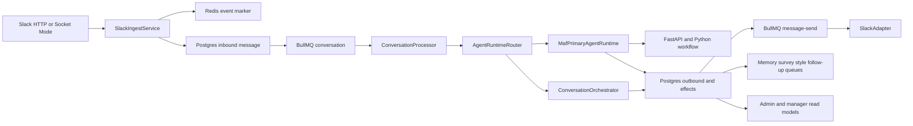
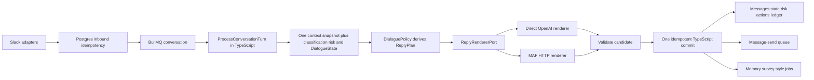

# Communication Architecture Audit

## Verdict

The product direction is sound: Slack is an adapter, PostgreSQL is authoritative, TypeScript owns policy and durable side effects, and MAF should render a candidate behind a replaceable boundary. The implementation no longer has those properties consistently.

The central problem is not a missing framework. It is duplicate ownership: two conversation brains, four outbound commit paths, two context authorities, and a runtime contract that asks Python to classify, assess risk, propose memory, and plan follow-ups even though the accepted dialogue spine says Python is a renderer.

Do not add another orchestrator, graph, queue, or state store. Converge the existing paths into one TypeScript prepare-render-commit turn.

## Current as-built flow

Measured shape of the hot path:

- `ConversationProcessor`: 891 lines.
- `ConversationOrchestrator`: 676 lines.
- `AgentRuntimeRouter`: 630 lines.
- `MafPrimaryAgentRuntime`: 762 lines.
- Python `conversation_workflow.py`: 1,150 lines.
- Python `model_provider.py`: 1,299 lines.
- Eleven queue names are registered; two have no producers or processors.
- Four separate use cases persist outbound messages and enqueue delivery.

## Findings

### Critical

1. **The MAF runtime endpoint is not protected by the configured internal secret.** The TypeScript client stores `INTERNAL_SERVICE_AUTH_SECRET` but sends only `content-type` and `x-trace-id`; `/runtime/process-message` has no matching auth dependency. This violates the runtime spine's scoped-service-auth invariant.

2. **The user-insights read is not tenant-scoped.** `UserInsightsController` accepts `_tenantId` and ignores it; the dashboard does not send a tenant ID. A user UUID plus the shared admin key can select another tenant's active survey window. Fix the predicate and contract before expanding the dashboard.

### High

3. **The canonical runtime schema has already drifted.** `packages/contracts/runtime/openapi.json` contains `greeting_opens_conversation`; the packaged Python copy does not. The parity test fails. Keep one editable source and generate/copy the packaged artifact during build.

4. **MAF turns have two brains.** `ConversationProcessor.buildInboundReplyContext` classifies in TypeScript to build `ReplyPlan`; Python then classifies the same message again with keyword and punctuation heuristics. The returned classification/risk can disagree with the plan used to render the reply.

5. **There is no single TypeScript committer.** `ConversationOrchestrator`, `MafPrimaryAgentRuntime`, `ProactiveCheckInUseCase`, and `FollowUpExecutionUseCase` each save outbound messages and enqueue delivery. They already differ on Slack thread propagation, metadata, extraction jobs, and policy application.

6. **The ledger is not a truthful side-effect barrier.** Risk, outbound persistence, queue publication, memory, goals, and follow-ups occur before or independently of the recorded phase. Candidate actions remain `not_started` while the attempt may advance to `actions_committed`. A retry can therefore trust evidence that does not describe the real commit.

7. **Ingress idempotency can lose a Slack event.** Redis is marked with `SET NX` before the PostgreSQL message write and BullMQ enqueue. A failure after the marker causes the Slack retry to be discarded. Use a PostgreSQL uniqueness boundary and stable queue job ID.

8. **The runtime has two context authorities.** The worker-prefetched request snapshot drives the model prompt, while the internal context tool loads a second snapshot used by policy/action code. Pick one. The smallest production path is the TypeScript-prepared request snapshot; remove the unused context-tool branch after parity evidence.

### Product architecture gaps

9. **The accepted `DialogueState` is not persisted.** `conversations.active_topic` exists but is unused; sitting continuity is inferred from a five-hour gap and recent-message limits vary by path.

10. **Consent and initiative policy are not implemented.** Extracted follow-up candidates are scheduled at a confidence threshold without employee consent. Warm check-ins and follow-up execution use different cadence checks, so the daily initiative budget is not one atomic policy.

11. **Goals are persisted but omitted from reply context.** The MAF request and internal context return `goals: []`; the TypeScript orchestrator derives goals from memory categories instead of loading the goal repository.

12. **Manager privacy invariants conflict.** ADR-008 says managers receive aggregate cohort-safe data and no individual risk/evidence. The current manager dashboard intentionally exposes identifiable employees, risk flags, and evidence behind a shared admin key. Decide whether this is an admin operations surface or a manager product surface; the current naming and policy cannot both be true.

## Recommended target

The key boundary change is to narrow the runtime switch from a whole-turn `AgentRuntimePort` to a two-implementation `ReplyRendererPort`. The request contains the TypeScript-owned context snapshot and `ReplyPlan`; the response contains reply text, typed renderer metadata, and diagnostics. It does not contain authoritative classification, risk, memory, goal, or follow-up decisions.

Use existing storage:

- Seed `DialogueState v1` in `conversations.active_topic`; do not add a table yet.
- Keep `scheduled_actions` for explicit reminders and consented open loops.
- Keep `runtime_attempts` for renderer rollout evidence, but advance phases from the same commit boundary.
- Reuse the follow-up execution path for all due proactive initiatives; do not add another queue.
- Keep memory, survey, and style enrichment asynchronous because their retries are independent of user-facing delivery.

## Order of work

### P0: restore trustworthy boundaries

1. Enforce internal auth on `/runtime/process-message` and send the credential from the TypeScript client.
2. Require tenant ID for user insights and tenant-filter every query.
3. Make the Python OpenAPI artifact generated from the canonical schema and put the parity test in the default CI/pre-push path.
4. Move Slack idempotency to PostgreSQL and use stable BullMQ `jobId` values.
5. Make ledger phases describe actual committed rows; never record `actions_committed` for `not_started` actions.

### P1: one vertical conversation slice

1. Load one context snapshot in TypeScript, including real goals and `DialogueState`.
2. Run one classifier/risk pass and one `DialoguePolicy` to produce `ReplyPlan`.
3. Make Python consume the plan as a renderer; delete Python intent, memory, goal, and follow-up invention from the product path.
4. Route both direct OpenAI and MAF candidates through one validate-and-commit function.
5. Disable silent extractor-created follow-ups until loop consent is represented in `DialogueState`.

### P2: converge proactive contact and remove migration scaffolding

1. Represent warm check-ins as due scheduled initiatives and execute them through the existing follow-up executor with one atomic daily budget and priority order.
2. Remove the special `check-in` branch from the conversation processor after parity tests pass.
3. After the MAF rollback window closes, delete shadow/canary-only recorders, temporary factories, and the legacy whole-turn runtime path.
4. Resolve the admin-versus-manager privacy decision before adding more identifiable analytics.

## Ponytail audit

- `delete:` dead `RISK_ANALYSIS` and `FOLLOWUP_PLANNING` queues. Remove names, registrations, tests, and admin polling. [`packages/contracts/src/queue.ts`, API/worker queue modules]
- `delete:` deprecated `ReplyBrief`/`replyBrief` compatibility path. Use `ReplyPlan` only. [`packages/application/src/ports/ai-provider.port.ts`]
- `yagni:` Python's nine-step workflow invents classification, memory, and follow-ups although TypeScript owns policy. Keep render plus boundary validation. [`agent-service/src/agent_service/workflows/conversation_workflow.py`]
- `shrink:` Python model-provider policy helpers and deterministic reply branches duplicate `ReplyPlan`. Retain structural output validation and renderer prompting. [`agent-service/src/agent_service/workflows/model_provider.py`]
- `shrink:` four TypeScript save-and-enqueue implementations. Replace with one idempotent commit function. [`packages/application/src/use-cases`]
- `native:` replace the two hand-written OpenAPI validators with already-installed schema tooling or generated validators. [`packages/contracts/src/runtime-contract-validation.ts`, `agent-service/src/agent_service/contracts/runtime_contract.py`]
- `shrink:` MAF hydration currently runs before runtime selection. Hydrate lazily and eliminate one model call on TypeScript turns. [`apps/worker/src/conversation/conversation.processor.ts`]
- `delete:` nominal single-implementation ports and unused adapter methods that are not injected anywhere. Keep the real Slack adapter boundary. [`packages/channel-core`, API ingestion port]
- `shrink:` duplicated Redis URL parsing and BullMQ setup. Reuse one helper in the existing config package. [API/worker queue and Redis services]
- `delete:` the worker-prefetched-versus-context-tool dual snapshot. Keep one authority; remove the other after parity evidence. [worker MAF context, internal MAF context API, Python tool client]

`net: about -1,500 to -2,500 production lines, -0 dependencies possible in the recommended slice.` A further roughly 1,000 lines become removable only after the MAF rollback window closes.

## Reviewer gate

- Mechanical spine lint: pass, zero findings.
- Good-spine rubric: semantic fail as a current build substrate; AD-14 is simultaneously decided and deferred, primary mode and real precedence are stale, and one committer is not fixed.
- Version/reality review: changes required; the schema copy, auth claim, session-store claim, trace-context claim, and action-ledger semantics do not match the current code.
- Adversarial divergence review: fail; compliant units can still choose conflicting context authority, mutation timing, ledger ownership, and session recovery.

Detailed reviews:

- `reviews/review-good-spine-2026-08-19.md`
- `reviews/review-version-reality-2026-08-19.md`
- `reviews/review-adversarial-divergence-2026-08-19.md`

## Verification

- CodeGraph end-to-end call-path inspection across Slack, API, worker, application, MAF, persistence, and dashboard reads.
- BMad `lint_spine.py`: pass with zero findings.
- Targeted runtime schema parity test: fail as expected, proving the packaged Python copy has drifted.
- Three independent agent reviews plus the Ponytail whole-scope complexity audit.
- No production code, architecture spine, database, or deployment state was changed.
