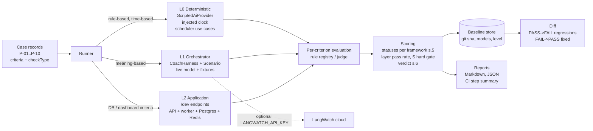
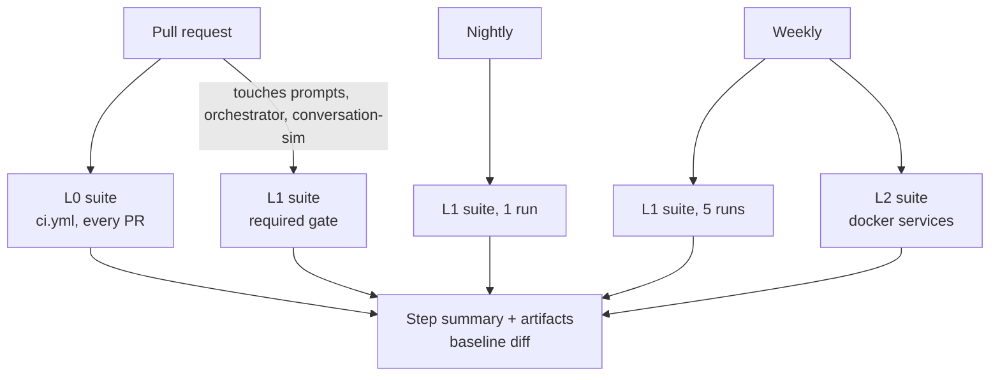
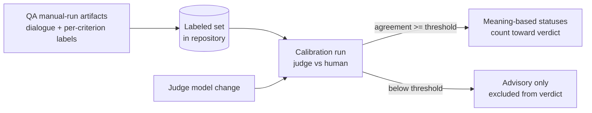

# Architecture Diagrams

## 1. Case flow

```mermaid
flowchart LR
  C[Case records<br/>P-01..P-10<br/>criteria + checkType] --> R[Runner]
  R -->|rule-based, time-based| L0[L0 Deterministic<br/>ScriptedAiProvider<br/>injected clock<br/>scheduler use cases]
  R -->|meaning-based| L1[L1 Orchestrator<br/>CoachHarness + Scenario<br/>live model + fixtures]
  R -->|DB / dashboard criteria| L2[L2 Application<br/>/dev endpoints<br/>API + worker + Postgres + Redis]
  L0 --> E[Per-criterion evaluation<br/>rule registry / judge]
  L1 --> E
  L2 --> E
  E --> S[Scoring<br/>statuses per framework s.5<br/>layer pass rate, S hard gate<br/>verdict s.6]
  S --> B[(Baseline store<br/>git sha, models, level)]
  B --> D[Diff<br/>PASS->FAIL regressions<br/>FAIL->PASS fixed]
  S --> O[Reports<br/>Markdown, JSON<br/>CI step summary]
  L1 -. optional LANGWATCH_API_KEY .-> W[LangWatch cloud]
```

## 2. CI schedule

```mermaid
flowchart TB
  PR[Pull request] --> L0r[L0 suite<br/>ci.yml, every PR]
  PR -->|touches prompts, orchestrator, conversation-sim| L1r[L1 suite<br/>required gate]
  N[Nightly] --> L1n[L1 suite, 1 run]
  Wk[Weekly] --> L1w[L1 suite, 5 runs]
  Wk --> L2w[L2 suite<br/>docker services]
  L0r & L1r & L1n & L1w & L2w --> Sum[Step summary + artifacts<br/>baseline diff]
```

## 3. Judge calibration loop

```mermaid
flowchart LR
  Q[QA manual-run artifacts<br/>dialogue + per-criterion labels] --> LS[(Labeled set<br/>in repository)]
  LS --> Cal[Calibration run<br/>judge vs human]
  Cal -->|agreement >= threshold| T[Meaning-based statuses<br/>count toward verdict]
  Cal -->|below threshold| A[Advisory only<br/>excluded from verdict]
  JM[Judge model change] --> Cal
```
