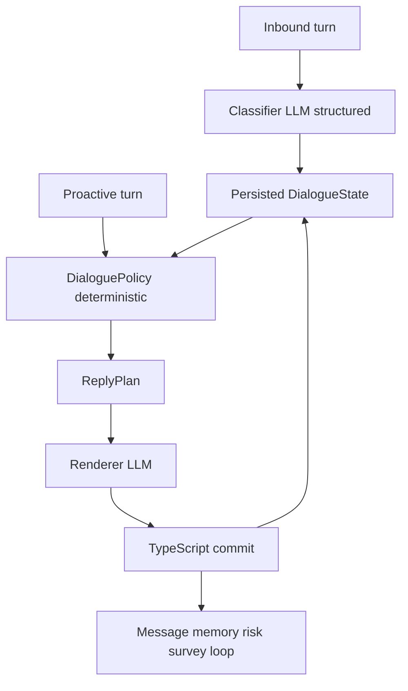

# Conversation Dialogue Architecture

This spine is the expansion contract for conversation behavior. New coaching, memory, pulse, reminder, or MAF work must fit these invariants. If a change cannot, it is a spine update, not a prompt tweak.

It does **not** replace the MAF runtime spine. Runtime switching, proposal/commit, and fallback barriers stay there. This spine owns **what a turn is allowed to do**.

## Design paradigm

**Mentor-companion.** The employee owns the agenda of an inbound turn. The system may speak first when the employee is silent. Coaching exists as at most one consented open loop over days, not as a GROW session inside Slack.



## Product identity

Locked 2026-08-18:

| Horizon | Who sets the agenda | Allowed move |
| --- | --- | --- |
| Inbound Slack turn | Employee | Companion reply. Touch an open loop only if the message is already in that territory. |
| Silence / cadence | System | One proactive message. Companion register. One thread, at most one question. |
| Days and weeks | Consented open loop | Return to that loop when it is due, or when the employee re-enters the territory. |

The product is an AI mentor in Slack (`PRODUCT_AND_FUNCTIONAL_REQUIREMENTS.md`), not a coach running a session (`buildRespondSystemPrompt`). Conversation mode remains a **tone register** (`normal` / `supportive` / `crisis`), never a session phase.

## Invariants

### CD-1 - Employee owns inbound agenda

- **Binds:** inbound reply generation
- **Prevents:** hijacking a "hi" or an unrelated update to chase a goal, pulse item, or overdue loop
- **Rule:** On `requestPurpose = inbound_message`, DialoguePolicy may continue the current thread or address new substance. It must not introduce an open loop, pulse probe, or parked thread unless the inbound message is already in that territory.

### CD-2 - System may initiate in silence

- **Binds:** proactive check-in, follow-up execution, reminders
- **Prevents:** a companion that only answers, and a second "survey bot" personality
- **Rule:** On `requestPurpose = proactive_check_in` (or equivalent follow-up/reminder execution), the system may set the agenda for that one message. The same `ReplyPlan` contract applies. Pulse is optional texture, not the primary reason to ping.

### CD-3 - One outbound initiative per day

- **Binds:** cadence scan, scheduled follow-ups, loop returns, pulse check-ins
- **Prevents:** pulse scan and follow-up queue independently messaging the same person
- **Rule:** All system-initiated contact shares one daily budget. Existing `DAILY_PROACTIVE_LIMIT = 1` is the seed. User-requested reminders bypass the cap; quiet hours and crisis guards still apply.

### CD-4 - Proactive reason priority

- **Binds:** who to ping and why
- **Prevents:** Gallup/Q12 backlog driving mentorship
- **Rule:** When several reasons are due, pick the first that passes safety and consent:

  1. Do not send (active crisis / proactive paused / quiet hours, except as already specified for reminders).
  2. Explicit user-requested reminder.
  3. Due open loop.
  4. Parked thread that is still live.
  5. Warm check-in. A pulse probe may ride along only if it fits naturally.

  A due open loop and a pulse probe must not both ask a question in the same message. If the day's reason is the loop, pulse waits.

### CD-5 - Loops require consent

- **Binds:** open loops, reminders, scheduled follow-ups that return to a personal commitment
- **Prevents:** silent `FollowUpScheduler` / MAF `schedule_follow_up` / memory-extractor candidates creating mentorship homework
- **Rule:** Persist an open loop only after a typed user act:
  - the employee asked to be reminded (`reminderRequest`), or
  - the employee agreed to a system offer ("want me to remind you?").
  Classifier may **propose** a loop-offer candidate. DialoguePolicy decides whether to surface it. TypeScript persists only after confirmation interpretation. Decline stores a cooldown. Unclear does not create a loop and must not ask a second clarifying question.

### CD-6 - At most one loop and one waiting subdialogue

- **Binds:** DialogueState
- **Prevents:** stacked confirmations, nested coaching, nagging
- **Rule:** At most one `awaiting_loop_consent`, one open loop, and one other active subdialogue (survey confirmation, probe wait, reminder, safety). A new offer is forbidden while any of those is active. If the employee leaves the territory after an offer, park the offer; do not force consent.

### CD-7 - Loop offer consumes the question budget

- **Binds:** `ReplyPlan.questionPolicy`
- **Prevents:** "substance question + want me to remind you?" in one turn
- **Rule:** A loop offer **is** the question for that turn (`maxQuestions = 1`). If the budget is already 0, or mode is sensitive/crisis, skip the offer. Do not stash it in the prompt for the model to "weave in".

### CD-8 - DialogueState is persisted, ReplyPlan is derived

- **Binds:** orchestrator, MAF context assembly, sim invariants
- **Prevents:** reconstructing the conversation from 8–20 messages and prompt rules every turn
- **Rule:** `ReplyPlan` is the output of DialoguePolicy over `(DialogueState, classification, risk, requestPurpose)`. It is not the store of thread, loop, or sitting. Seed storage may extend `conversations.active_topic` (already in schema, currently unused). Classifier and renderer stay stateless given that input.

### CD-9 - One DialoguePolicy in TypeScript

- **Binds:** `packages/application`
- **Prevents:** `buildReplyPlan`, worker `buildInboundReplyContext`, and `agent-service` `model_provider` inventing different question/length/probe rules
- **Rule:** Worker and Python consume `ReplyPlan` / `replyPolicy`. They must not re-derive conversational gates. Keyword, punctuation, or language-script heuristics remain forbidden as behavior gates.

### CD-10 - Python/MAF generates, TypeScript commits

- **Binds:** runtime split (inherits MAF AD-1, AD-2, AD-10)
- **Prevents:** a second conversation brain
- **Rule:** `agent-service` may render a candidate reply from the supplied plan and context. It must not own intent classification, memory persistence, loop creation, or follow-up scheduling. Fixture/static workflow steps that invent classification or dummy memory candidates are not a product path.

### CD-11 - Prompt is register, not policy

- **Binds:** `packages/ai-openai` respond prompt, MAF model provider prompt
- **Prevents:** conversation quality being "fixed" by another prohibition list
- **Rule:** Prompts describe persona and how to realize an already-chosen `ReplyPlan`. New product behavior lands in DialogueState, DialoguePolicy, or a typed classifier field. Style anti-patterns may remain as a cheap renderer backstop, not as the source of turn-taking.

### CD-12 - Goals are memory for return, not a session script

- **Binds:** `userGoals`, memory items, runtime context
- **Prevents:** empty `goals: []` in live context, and also a forced GROW walk through stored goals
- **Rule:** Active goals must be available to policy and renderer. They do not change inbound agenda by themselves. A stored goal becomes an open loop only via CD-5.

## DialogueState seed

Minimal persisted shape. Code owns the exact schema once implemented.

```text
DialogueState
  sitting: { startedAt, lastInboundAt }     // same sitting vs new sitting
  openThread: null | { summary, status: open | parked | closed, startedAt }
  openLoop: null | { content, dueAt, sourceMessageId, status: open }
  subdialogue: none
    | awaiting_loop_consent { offerSummary, offeredAt }
    | awaiting_survey_confirmation   // existing ADR-007 path
    | awaiting_probe_response
    | reminder
    | safety
  loopOfferCooldownUntil: timestamp | null
```

`ConversationMode` is not part of this state. Safety/tone still comes from classification + risk for the current turn.

## Turn policy

| `requestPurpose` | Policy input extra | Forbidden |
| --- | --- | --- |
| `inbound_message` | latest user substance, current subdialogue | New initiative outside current territory |
| `proactive_check_in` | CD-4 reason | Two questions; survey language; starting a loop without a later inbound consent turn |

Confirmation interpretation (survey group or loop offer) is a typed classifier/use-case result, not a regex on the inbound text.

## How to expand

Add behavior by extending **one** of these surfaces. Do not add a parallel path.

| If you want to add… | Extend | Do not |
| --- | --- | --- |
| A new reason to ping | CD-4 priority list + DialoguePolicy | A new worker that sends Slack on its own cadence |
| A new in-turn move | `ReplyPlan.responseMove` + policy | A new paragraph of "never do X" in `respond.ts` |
| A new waiting interaction | `subdialogue` variant, modeled like ADR-007 | Booleans inside `ConversationOrchestrator` |
| Memory the coach should use | Context assembly + typed grounding | Dumping more items into the prompt |
| Better MAF replies | Consume plan/state; improve renderer | Python keyword classification or dummy memory writes |
| Session continuity | `sitting` + optional rolling digest written off the hot path | Larger `LIMIT` on recent messages as the strategy |
| Semantic recall | ADR-003 as a retrieval port behind context assembly | Assuming pgvector already works (it is not wired) |

Survey confirmation (ADR-007) is the reference subdialogue. Loop consent must copy that shape, not the orchestrator's ad-hoc flags.

## Current gaps versus this spine

These are accepted as-built debts, not permission to keep growing them:

| Gap | Where today |
| --- | --- |
| No persisted thread/loop/sitting | `conversations.active_topic` unused; `isSessionStart` is a 5-hour heuristic |
| Two conversation brains | `ConversationOrchestrator` vs `ConversationWorkflow` |
| Three policy copies | `buildReplyPlan`, worker inbound reply context, `model_provider.py` |
| Silent follow-up creation | `FollowUpSchedulerUseCase` from extractor candidates at confidence ≥ 0.6 |
| Goals omitted from MAF context | `goals: []` in `ConversationProcessor` |
| Keyword/punctuation gates in Python | `_infer_situation_intent` and related helpers |
| Prompt-as-policy | `packages/ai-openai/src/prompts/respond.ts` |
| Context SQL in the adapter | `ConversationProcessor.loadMafCandidateContext` |
| MAF used as a linear pipeline wrapper | single executor, no graph, session store unused |

## Deferred

| Decision | Revisit when |
| --- | --- |
| Full GROW / session-phase FSM | Only if the product identity changes away from mentor-companion |
| LangGraph or other agent graph | Only if we need durable multi-step tool loops beyond one classify + one render |
| Temporal for this slice | When BullMQ retry/idempotency cost exceeds ADR-010 substitution (runtime ledger already exists) |
| pgvector live retrieval | After category quotas + recency on memory, if grounding still fails |
| Transfer of loop/follow-up aggregate ownership to Python | Never, unless MAF AD-2 is explicitly superseded |
| Multi-loop stacks | If users keep several live commitments and CD-6 is proven too tight |

## Open questions (non-blocking)

- Exact cooldown after a declined loop offer (sitting vs N days).
- Whether a parked loop offer can be re-surfaced on the next proactive check-in without a new classifier proposal.
- Storage: widen `conversations.active_topic` vs a dedicated dialogue-state table.

These do not block adopting the invariants. Pick them in the first implementation story that persists `DialogueState`.
